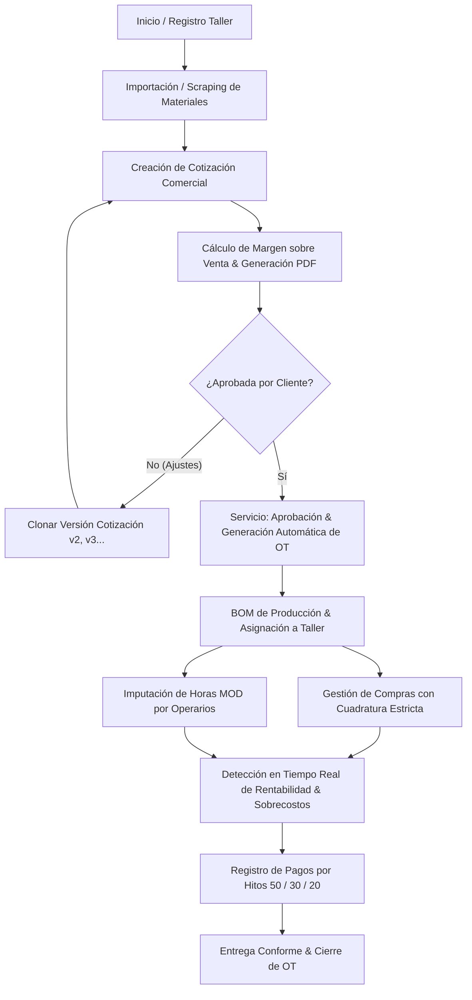

# ARQUITECTURA, ESTRUCTURA Y FUNCIONAMIENTO DETALLADO DEL SISTEMA TALLERLOGIK SAAS

Este documento proporciona una descripción exhaustiva del sistema **TallerLogik SaaS**, una plataforma web B2B Multi-Tenant diseñada específicamente para la gestión comercial, costeo, compras, inventario, producción y análisis de rentabilidad en mueblerías especializadas y talleres a medida.

---

## 1. VISIÓN GENERAL Y OBJETIVOS DEL SISTEMA

**TallerLogik** resuelve las problemáticas críticas que enfrentan los talleres de fabricación a medida:
* **Separación entre lo Comercial y lo Operativo:** Permite cotizar propuestas a clientes (con versiones v1, v2) sin alterar la Orden de Trabajo (OT) en producción hasta que la cotización es formalmente aprobada.
* **Costeo Real con Mermas:** Aplica mermas por defecto a tableros y maderas, costeando unidades comerciales completas en lugar de fracciones teóricas.
* **Cálculo Financiero de Margen sobre Venta:** Utiliza la fórmula financiera real de margen sobre venta ($P = \frac{C}{1 - M}$) para garantizar que la rentabilidad deseada no sea erosionada.
* **Cuadratura Estricta en Compras:** Obliga a que el desglose de facturas asignado a proyectos sume exactamente el total neto pagado al proveedor.
* **Imputación de Mano de Obra Directa (MOD):** Registra el costo de tiempo de operarios de forma inmutable manteniendo el valor histórico de la hora/hombre.
* **Aislamiento Multi-Tenant:** Garantiza que cada empresa (taller) tenga un aislamiento total y privado de sus datos.

---

## 2. STACK TECNOLÓGICO Y ARQUITECTURA DE SOFTWARE

### Stack Backend & Base de Datos
* **Lenguaje:** Python 3.12+
* **Framework Backend:** Django 5.x (ORM relacional, Vistas basadas en clases/funciones, Signals y Capa de Servicios desacoplada `services.py`).
* **Base de Datos:** PostgreSQL con aislamiento por clave foránea `id_empresa` e índices tenant-scoped.
* **Procesamiento Asíncrono / Tareas en Segundo Plano:** Celery + Redis / Django-Q (para procesamiento de PDFs pesados y tareas de scraping).

### Stack Frontend & Interfaz de Usuario
* **Plantillas:** Django Templates (`templates/html/`) estructurados de forma modular.
* **Reactividad Ligera (Sin SPA):** **HTMX** (para interacciones dinámicas de servidor sin recargar página) + **Alpine.js** (para estado local e interactividad de UI).
* **Diseño y Estilos:** **Tailwind CSS** compilado.
* **Paleta de Colores UI:**
  * Primario / Sidebar / Navbar: `#0F172A` (Pizarra Oscura).
  * Acciones / Botones / Destacados: `#0284C7` (Azul Eléctrico).
  * Alertas / Desviaciones / Sobrecostos: `#DC2626` (Rojo Alerta).

### Servicios e Integraciones Externas
* **Generación de Reportes / PDF:** **WeasyPrint** (renderizado de cotizaciones comerciales desde plantillas HTML/CSS en PDF).
* **Almacenamiento de Archivos (Media):** Cloudflare R2 / AWS S3 vía `django-storages` (fotos de boletas, planos de despiece, comprobantes de pago).
* **Scraping de Precios de Materiales:** Scraping en vivo de la API REST pública de Oracle Commerce Cloud (Imperial Chile) para actualizar el Catálogo Maestro Global de Materiales.

---

## 3. ESTRUCTURA DE DIRECTORIOS DEL PROYECTO

La estructura del proyecto sigue una separación modular limpia dentro del directorio `apps/` y una organización estricta de archivos estáticos y plantillas:

```text
tallerLogik/
├── apps/                        # Aplicaciones backend Django
│   ├── core_auth/               # Autenticación, Usuarios, Tenants y Auditoría
│   ├── configuracion_base/      # Clientes, Proveedores, Materiales e Inventario
│   ├── cotizador/               # Presupuestos comerciales, Margen sobre Venta y PDF
│   ├── ordenes_trabajo/         # Proyectos/OT en producción y BOM
│   ├── compras_gastos/          # Facturas, Gastos a Proyectos y Tiempos MOD
│   └── rentabilidad_cobranzas/  # Dashboard, Sobrecostos y Cobranzas (Hitos)
├── config/                      # Configuración global Django (settings, urls, wsgi)
├── docs/                        # Documentación técnica y fórmulas financieras
├── media/                       # Archivos dinámicos subidos por usuarios
├── static/                      # Archivos estáticos
│   ├── css/                     # Tailwind CSS y estilos personalizados
│   ├── js/                      # Alpine.js y scripts auxiliares
│   └── img/                     # Renders, íconos y logotipos
├── templates/
│   └── html/                    # Django Templates + Fragmentos HTMX por app
├── Dockerfile                   # Configuración de contenedor Docker
├── docker-compose.yml           # Orquestación de servicios (Django, Postgres, Redis)
├── manage.py                    # Gestor de comandos de Django
├── requisitos.txt / pyproject   # Dependencias de Python
└── especificaciones.md          # Requerimientos originales del SaaS
```

---

## 4. DETALLE DE MÓDULOS Y SUS COMPONENTES

El sistema está dividido en **6 módulos principales**, cada uno enfocado en un dominio específico del negocio de carpintería y mueblería a medida.

---

### MÓDULO 1: `apps/core_auth` (Seguridad, Tenants & Auditoría)

Este módulo gestiona el control de acceso, los tenants (talleres suscritos) y la trazabilidad de operaciones.

#### 1. Entidades / Modelos (`models.py`)
* **`SoftDeleteModel` (Abstracto):**
  * Proporciona borrado lógico reemplazando `.delete()` por la asignación de `eliminado_en = timezone.now()`.
  * Filtra automáticamente registros borrados mediante `SoftDeleteManager`.
* **`Empresa` (Tenant):**
  * Representa a un taller o mueblería suscrita al SaaS.
  * Campos: `id` (UUID), `nombre_empresa`, `rut_o_identificacion`, `plan_suscripcion` (`basico`, `pro`, `enterprise`), `fecha_registro`.
* **`TenantAwareModel` (Abstracto):**
  * Hereda de `SoftDeleteModel`.
  * Agrega la clave foránea `id_empresa = ForeignKey(Empresa, on_delete=models.RESTRICT)` a todos los modelos de negocio.
  * Sobrescribe el manager para aislar consultas mediante el tenant activo.
* **`Usuario` (Custom User Model):**
  * Hereda de `AbstractBaseUser`, `PermissionsMixin` y `SoftDeleteModel`.
  * Utiliza `correo_electronico` como identificador de inicio de sesión (`USERNAME_FIELD`).
  * Incluye 8 roles definidos: `superadmin_saas`, `dueno_taller`, `jefe_taller`, `operario`, `montador`, `compras`, `disenador`, `vendedor`.
  * Contiene el campo `costo_hora` (Decimal) para valorizar la mano de obra directa del usuario en las imputaciones de tiempo.
* **`AuditoriaLog`:**
  * Bitácora inmutable de eventos de negocio en base de datos.
  * Registra: `id_empresa`, `id_usuario`, `accion`, `detalles`, `direccion_ip`, `fecha_registro`.

#### 2. Middleware & Control de Aislamiento
* **`TenantMiddleware`:** Intercepta la petición HTTP y vincula la instancia de `Empresa` correspondiente al usuario autenticado en `request.tenant`, asegurando que ninguna consulta ORM pueda filtrar o modificar datos de otra empresa.

---

### MÓDULO 2: `apps/configuracion_base` (Directorio, Materiales e Inventario)

Gestiona los catálogos base, el directorio unificado de clientes y proveedores, el catálogo global de materiales con scraping automático y el control de inventario de bodega.

#### 1. Entidades / Modelos (`models.py`)
* **`Cliente`:** Directorio unificado de clientes del taller (Razón Social, RUT, persona de contacto, correos, teléfonos, dirección, comuna, ciudad).
* **`Proveedor`:** Directorio de proveedores de materiales e insumos, incluyendo datos bancarios para transferencias.
* **`MaterialGlobal`:**
  * Catálogo maestro de materiales de referencia poblado mediante scraping automatizado.
  * Genera automáticamente un **SKU Interno** secuencial inmutable (ej. `TL-000001`, `TL-000002`).
  * Almacena el `sku_proveedor` real (clave de deduplicación de Imperial), categoría (`Tableros`, `Maderas`, `Quincalleria`, `Insumos`), unidad de medida y costo unitario.
* **`Material`:**
  * Copia o catálogo privado de cada taller (`TenantAwareModel`).
  * Almacena `costo_unitario`, `porcentaje_merma_defecto` (por defecto 10%), `stock_actual` y `stock_minimo`.
  * Vinculado opcionalmente a `MaterialGlobal` para actualización automática de precios.
* **`MovimientoInventario`:**
  * Bitácora inmutable de entradas, salidas y ajustes de stock en bodega.
  * Tipos de movimiento: `INGRESO_INICIAL`, `COMPRA_BODEGA`, `DESCUENTO_OT`, `AJUSTE_MANUAL`, `DEVOLUCION`.
  * Registra `cantidad`, `stock_resultante`, `id_proyecto` (opcional), `id_usuario` y `fecha_movimiento`.

#### 2. Capa de Servicios (`services.py` y `services_inventario.py`)
* **`ejecutar_scraping_imperial(use_mock=False)`:**
  * Consulta en vivo la API REST pública de Imperial Chile.
  * Extrae SKUs, nombres, precios y categorías de materiales.
  * Actualiza `MaterialGlobal` y **propaga automáticamente los precios actualizados** a todos los materiales importados por los talleres que tengan `actualizacion_automatica = True`.
* **`importar_material_a_taller(material_global_id, empresa, usuario)`:**
  * Clona un material del catálogo global al inventario privado del taller con merma inicial del 10%.
* **`registrar_movimiento_inventario(material, cantidad, tipo_movimiento, usuario, proyecto, observaciones)`:**
  * Ejecuta la actualización atómica del `stock_actual` del material (usando `select_for_update()` para evitar condiciones de carrera) y genera la entrada en la bitácora de inventario.

---

### MÓDULO 3: `apps/cotizador` (Presupuestos Comerciales & Versionamiento)

Módulo encargado del costeo preciso de proyectos comerciales, cálculo de precios de venta, versionamiento (v1, v2) y generación de presupuestos en PDF.

#### 1. Entidades / Modelos (`models.py`)
* **`Cotizacion`:**
  * Cabecera de la propuesta comercial (`numero_cotizacion`, `version`, `titulo_propuesta`).
  * Costos estimados desglosados: `costo_materiales_estimado`, `costo_mano_obra_estimado`, `costo_servicios_estimado`, `costo_indirecto_cif_estimado`, `costo_total_estimado`.
  * **Cálculo de Margen sobre Venta:** Almacena `margen_objetivo_pct` (ej. 35%) y calcula el `precio_venta_neto`.
  * Estados: `borrador`, `enviada`, `aprobada`, `rechazada`, `expirada`.
  * Métodos de cálculo de entrega: `dias_mano_obra_estimados` (calcula días laborables considerando 8 hrs = 1 día) y `fecha_entrega_sugerida`.
* **`ItemCotizacion`:**
  * Ítem de costo que compone el presupuesto.
  * Tipos: `Material`, `Mano_Obra`, `Servicio_Tercero`, `Insumo`.
  * Aplica merma al costo: $\text{Subtotal} = (\text{Cantidad} \times \text{Costo Unitario}) \times \left(1 + \frac{\text{Merma\%}}{100}\right)$.

#### 2. Capa de Servicios (`services.py`)
* **`recalcular_cotizacion(cotizacion)`:**
  * Agrupa y suma los subtotales de todos los ítems por categoría y recalcula el costo total estimado y el precio de venta neto.
* **`clonar_version_cotizacion(cotizacion_id, usuario)`:**
  * Permite crear una nueva versión comercial (ej. v1 -> v2) manteniendo el mismo `numero_cotizacion`, duplicando la cabecera y todos los ítems en estado `borrador` para modificaciones.

#### 3. Cálculo Financiero Estricto (Margen sobre Venta)
$$P = \frac{\text{Costo Total Estimado}}{1 - \left(\frac{\text{Margen Objetivo \%}}{100}\right)}$$

*Ejemplo:* Si el Costo Total es **$100.000** y el Margen Objetivo es **35%**:
$$P = \frac{100.000}{1 - 0.35} = \frac{100.000}{0.65} = \$153.846,15$$
*(Evita el error común de usar markup $100.000 \times 1.35 = \$135.000$, el cual entregaría un margen real de solo 25.9%).*

---

### MÓDULO 4: `apps/ordenes_trabajo` (Producción Operativa & Órdenes de Trabajo)

Gestiona la ejecución física en el taller una vez que el cliente aprueba la cotización comercial.

#### 1. Entidades / Modelos (`models.py`)
* **`Proyecto` (Orden de Trabajo - OT):**
  * Representa la OT en producción.
  * Vinculada a la `id_cotizacion_origen` y `id_cliente`.
  * Identificador único correlativo tenant-scoped: `codigo_ot` (ej. `OT-1001`).
  * Estados de producción: `planificado`, `corte`, `armado`, `laca_pintura`, `montaje`, `entregado`.
  * Guarda copias inmutables del valor comercial: `precio_cotizado`, `costo_presupuestado_total`, `margen_objetivo_pct`.
* **`ItemProyecto` (BOM de Producción):**
  * Lista de materiales e insumos necesarios para la fabricación.
  * Incluye el campo `agregado_rectificacion` (Boolean) para diferenciar ítems presupuestados originalmente de adiciones en obra tras la toma de medidas.
  * Control de descuento de stock de bodega (`cantidad_descontada_stock`, `stock_descontado`).

#### 2. Capa de Servicios (`services.py`)
* **`aprobar_cotizacion_y_generar_ot(cotizacion_id, usuario)`:**
  * Transición atómica de lo comercial a lo operativo.
  * Cambia el estado de la cotización a `aprobada`.
  * Crea el `Proyecto` (OT) asignando el código correlativo (convirtiendo `COT-1001` a `OT-1001`).
  * Clona todos los ítems comerciales de la cotización al BOM de producción (`ItemProyecto`).
  * Genera entrada en el log de auditoría.

---

### MÓDULO 5: `apps/compras_gastos` (Compras, Gastos & Tiempos MOD)

Gestiona las compras reales a proveedores, la imputación de boletas/facturas a proyectos con cuadratura estricta y el registro de horas de mano de obra de los operarios.

#### 1. Entidades / Modelos (`models.py`)
* **`FacturaCompra`:**
  * Cabecera del comprobante de compra (`numero_factura`, `proveedor`, `fecha_emision`, `monto_total_neto`, `forma_pago`, `banco_origen`).
* **`GastoProyecto`:**
  * Distribución del monto neto de una factura entre una o varias Órdenes de Trabajo.
  * Tipos de gasto: `Material`, `Ferreteria_Imprevista`, `Flete`, `Subcontrato`.
* **`RegistroTiempo` (Mano de Obra Directa - MOD):**
  * Registro de horas trabajadas por operarios en el taller.
  * Etapas: `Corte`, `Armado`, `Laca_Pintura`, `Montaje`.
  * **Costo inmutable:** Al guardar, calcula automáticamente $\text{Costo MOD} = \text{Horas Trabajadas} \times \text{Usuario.costo\_hora}$, fijando el valor histórico en ese instante.

#### 2. Capa de Servicios (`services.py`)
* **`registrar_factura_y_distribuir_gastos(factura_data, desgloses_list, usuario)`:**
  * **Validación de Cuadratura Estricta:** Suma todos los desgloses en `desgloses_list` y verifica que equivalgan exactamente al `monto_total_neto` de la factura. Si hay una diferencia (aunque sea de 1 centavo), lanza un `ValidationError` deteniendo la transacción.
  * Si un desglose incluye un ítem no presupuestado originalmente, crea automáticamente un `ItemProyecto` marcado con `agregado_rectificacion = True` y actualiza el costo presupuestado de la OT.

---

### MÓDULO 6: `apps/rentabilidad_cobranzas` (Control Financiero & Cobranzas)

Monitorea la salud financiera de cada proyecto y del taller en general, detectando sobrecostos en tiempo real y gestionando el cobro por hitos.

#### 1. Entidades / Modelos (`models.py`)
* **`PagoProyecto`:**
  * Registro de abonos y pagos efectuados por el cliente.
  * Hitos comerciales estándar: `Anticipo_50` (50%), `Avance_30` (30%), `Saldo_Entrega_20` (20%), `Otro`.
  * Medios de pago: `Transferencia`, `Efectivo`, `Cheque`, `Tarjeta`.

#### 2. Capa de Servicios (`services.py`)
* **`calcular_rentabilidad_proyecto(proyecto)`:**
  * Calcula en tiempo real los indicadores clave de desempeño (KPIs) para una OT:
    1. **Costo Real Total:** $\text{Gastos Materiales Reales} + \text{Costo MOD Real}$.
    2. **Desviación de Costo:** $\text{Costo Real} - \text{Costo Presupuestado}$.
    3. **Detector de Sobrecosto:** Marca alerta si $\text{Costo Real} > \text{Costo Presupuestado}$.
    4. **Margen Real Obtenido:** $\text{Margen Real \$} = \text{Precio Cotizado} - \text{Costo Real}$, recalculando el $\% \text{Margen Real}$.
    5. **Estado de Cobranza:** Suma pagos recibidos y determina el saldo pendiente.
* **`obtener_metricas_globales_taller(tenant)`:**
  * Agrupa métricas para el Dashboard principal del taller: Total facturado, costo real acumulado, utilidad neta global, porcentaje de margen global, total cobrado vs. saldo pendiente de cobro y número de proyectos en sobrecosto.

---

## 5. FLUJO OPERATIVO COMPLETO Y ACCIONES REALIZADAS POR EL SISTEMA

A continuación se detalla la secuencia de interacción de un taller en TallerLogik:



### Paso 1: Configuración e Inventario Base
1. El Administrador del Taller inicia sesión y navega al catálogo de materiales.
2. El sistema ejecuta `ejecutar_scraping_imperial()` para traer precios actualizados desde la API de Imperial Chile.
3. El taller importa los materiales frecuentemente utilizados (`importar_material_a_taller`), estableciendo mermas específicas y niveles de stock mínimo.

### Paso 2: Creación de Presupuesto Comercial (Cotizador)
1. El diseñador/vendedor crea una cotización para un cliente.
2. Agrega ítems de material, insumos, mano de obra estimada y servicios externos.
3. El sistema aplica la merma automáticamente y recalcula los subtotales.
4. Con el margen objetivo (ej. 35%), el sistema calcula el precio neto de venta ($P = \frac{C}{1 - 0.35}$).
5. Se genera el PDF comercial mediante **WeasyPrint** listo para enviar al cliente.
6. Si el cliente solicita cambios, se llama a `clonar_version_cotizacion` para generar la versión v2 manteniendo el historial intacto.

### Paso 3: Aprobación y Paso a Producción (Orden de Trabajo)
1. Al confirmarse el contrato, se invoca `aprobar_cotizacion_y_generar_ot`.
2. La cotización se congela en estado `aprobada`.
3. Se crea la OT con código correlativo (ej: `OT-1045`).
4. El BOM comercial se duplica a `items_proyecto` para la gestión operativa de fábrica.

### Paso 4: Compras y Control de Bodega
1. Se reciben facturas o comprobantes de compra de materiales.
2. En el módulo de compras, se ingresa la cabecera de la factura y se distribuyen los montos netos a las distintas OTs (`registrar_factura_y_distribuir_gastos`).
3. El sistema valida la **cuadratura matemática exacta**. Si el monto coincide, registra los gastos y actualiza las desviaciones del proyecto.
4. Si se retiran materiales de la bodega del taller, se registra un `MovimientoInventario` descontando el stock atómicamente.

### Paso 5: Control de Mano de Obra Directa (MOD)
1. Los operarios o el jefe de taller registran el tiempo invertido en las etapas de Corte, Armado, Laca y Montaje mediante formularios responsive en HTMX.
2. El sistema multiplica las horas ingresadas por la tarifa por hora del usuario (`costo_hora`) y registra el costo real de MOD de forma inmutable.

### Paso 6: Dashboard de Rentabilidad y Cobranzas
1. El dueño o administrador consulta la rentabilidad del proyecto.
2. `calcular_rentabilidad_proyecto` compara en tiempo real el Costo Presupuestado vs. Costo Real (Compras + MOD).
3. Si existe una desviación de costos, el sistema alerta visualmente con color rojo (`#DC2626`).
4. Se registran los pagos recibidos del cliente (Anticipo 50%, Avance 30%, Saldo 20%), monitoreando el saldo pendiente de cobro hasta la entrega final del mueble.

---

## 6. MATRIZ DE SEGURIDAD Y PERMISOS POR ROL

| Rol | Gestión de Usuarios | Cotizador / Precios | Producción (OT) | Compras & Gastos | Imputación MOD | Dashboard Rentabilidad |
| :--- | :---: | :---: | :---: | :---: | :---: | :---: |
| **Superadmin SaaS** | Total | Lectura | Lectura | Lectura | Lectura | Total Global |
| **Dueño Taller** | Total Tenant | Total | Total | Total | Total | Total Tenant |
| **Jefe Taller** | Sin acceso | Lectura | Total | Total | Total | Vista Operativa |
| **Operario** | Sin acceso | Sin acceso | Lectura | Sin acceso | Registrar Propias | Sin acceso |
| **Montador** | Sin acceso | Sin acceso | Lectura | Sin acceso | Registrar Propias | Sin acceso |
| **Compras** | Sin acceso | Lectura | Lectura | Total | Sin acceso | Sin acceso |
| **Diseñador** | Sin acceso | Total | Lectura | Sin acceso | Sin acceso | Sin acceso |
| **Vendedor** | Sin acceso | Total | Lectura | Sin acceso | Sin acceso | Sin acceso |

---

## 7. MANTENIMIENTO Y COMANDOS DE DESPLIEGUE

### Iniciar Entorno de Desarrollo (Docker Compose)
```bash
docker-compose up -d --build
```

### Ejecutar Migraciones de Base de Datos
```bash
python manage.py makemigrations
python manage.py migrate
```

### Ejecutar Tarea de Scraping de Materiales Imperial
```bash
python manage.py shell -c "from apps.configuracion_base.services import ejecutar_scraping_imperial; ejecutar_scraping_imperial()"
```

### Ejecutar Suite de Pruebas Unitarias
```bash
python manage.py test apps.core_auth apps.configuracion_base apps.cotizador apps.ordenes_trabajo apps.compras_gastos apps.rentabilidad_cobranzas
```

---
*Documentación generada para TallerLogik SaaS - Sistema de Arquitectura y Desarrollo de Software.*
